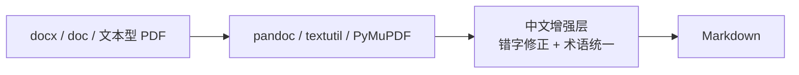
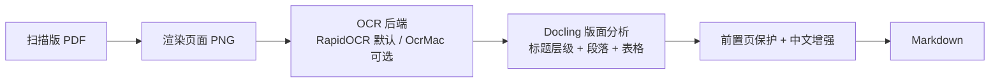

# ocr-docs

中文教育/特教文档 → 规范 Markdown 的转换工具（CLI + Agent 技能）。

**定位**：通用 PDF→Markdown 工具（nutrient / MinerU / Docling）已成熟，本项目不与之正面竞争通用场景；差异化在于 **开源（MIT）+ 中文教育文档垂直增强**——高置信错字修正、封面/版权页保护、可扩展特教术语表，并打包为 AI Agent 可直接使用的技能（SKILL.md）。

## 架构（薄壳复用）

**大部分能力直接引入社区成熟方案，不重复造轮子；只自研数据资产与薄胶水层。**

| 功能 | 引入社区 | 自研 |
|------|----------|------|
| 版面分析（标题/段落/表格） | Docling | — |
| 扫描 OCR | RapidOCR（默认，简体中文实测最优）/ OcrMac（macOS 可选）| — |
| 普通文档转换 | pandoc / textutil / PyMuPDF | — |
| CLI 框架 | typer | — |
| Agent 技能分发 | skills.sh / marketplace 生态 | — |
| 中文错字词表（45 条） | — | ✅ 本项目核心 |
| 前置页（封面/版权）保护 | — | ✅ 本项目核心 |
| 特教术语表 | — | ✅ 本项目核心 |
| 案例→Dify 知识库预处理（prep） | — | ✅ 清洗/拆分/元数据/脱敏 |
| CLI 编排 + SKILL.md | — | ✅ 本项目 |

默认 OCR 后端选择有社区实测支撑：RapidOCR 简体中文 Han CER 0.054（优于 OcrMac 0.097 / Tesseract 0.116），且模型随包分发、离线可用。

## 安装（三通道）

### 1. skills.sh（AI Agent / 跨 agent 通用，推荐）

```bash
npx skills add xlight/ocr-docs
```

works with Claude Code / Codex / Cursor / Zed 等所有支持 SKILL.md 的 agent。

### 2. Claude Code Marketplace

```bash
/plugin marketplace add xlight/ocr-docs
/plugin install ocr-docs@ocr-docs
```

### 3. PyPI（人类用户 / CI）

```bash
pip install ocr-docs
# 扫描版 PDF 转换需要额外依赖
pip install "ocr-docs[scanned]"
# macOS 可选 OCR 后端（高速、免下载）
pip install "ocr-docs[ocrmac]"
```

## 快速开始

```bash
# 普通文档转换（docx / doc / 文本型 PDF）
ocr-docs convert 输入.docx -o 输出.md
ocr-docs convert ./docs -o ./out           # 目录递归批量

# 扫描版 PDF（OCR + 版面分析）
ocr-docs convert --scanned 扫描书.pdf -o 输出.md
ocr-docs convert --scanned 扫描书.pdf --front-matter-pages 4 -o 输出.md

# 案例 Markdown → Dify 知识库输入（清洗/拆分/元数据/脱敏，双库输出）
ocr-docs prep 案例/markdown -o 案例/markdown/prep
```

## 工作流

### 1. 普通文档（有文本层）



### 2. 扫描文档（纯图片 PDF）



## 参数速查

| 参数 | 说明 | 默认 |
|------|------|------|
| `convert <输入>` | 输入文件或目录 | 必填 |
| `-o, --output` | 输出文件或目录 | 输入同名 .md |
| `--scanned` | 扫描模式（OCR）| 关 |
| `--ocr-engine` | `rapidocr`（跨平台）/ `ocrmac`（macOS）| rapidocr |
| `--front-matter-pages N` | 前置页保护数 | 0 |
| `--no-enhance` | 跳过中文增强 | 关 |
| `prep <输入目录>` | 案例 Markdown → Dify 知识库输入 | 必填 |
| `prep -o, --output` | prep 输出目录 | 输入目录下 prep/ |
| `refine <输入目录>` | 拆 OCR 修缮任务清单（Agent 逐段修缮后 refine-apply 拼装）| 必填 |
| `refine -o, --output` | 任务清单 JSON 输出路径 | 输入同级 refine_tasks.json |
| `refine --limit N` | 抽样：只拆前 N 个文件 | 全量 |
| `refine-apply <tasks.json>` | 套安全校验拼装 Agent 修缮结果，写回 refined/ | 必填 |

## 案例→Dify 知识库预处理（prep）

`ocr-docs prep` 将案例目录下的 Markdown（评估报告/个案记录/教学案例/讲义/教材/映射规则）转为适合 Dify 知识库检索的结构化文档集：


- 输出 `prep/kb_case/<源文档>/`（案例库）+ `prep/kb_rule/<源文档>/`（映射规则库），按原文档文件名分目录
- 文件名体现核心特征：`{类型}_{代号}_{障碍类别}_{核心行为}.md`
- 附带 `dify_config.md`（Dify 导入配置模板）与 `prep_report.json`（统计/元数据覆盖/待脱敏清单）
- 详见 [`京小融/案例/案例Markdown导入Dify知识库预处理说明.md`](../京小融/案例/案例Markdown导入Dify知识库预处理说明.md)

## OCR 错字修缮（refine）

拆分出的 markdown（尤其扫描书）常带 OCR 错字/乱码。修缮采用「CLI 拆任务 → Agent 修缮 → CLI 校验拼装」，**CLI 不调用任何 LLM、不需要 API key**：

```mermaid
flowchart LR
    A[prep 输出目录] --> B[ocr-docs refine<br/>拆段级修缮任务 JSON]
    B --> C[Agent 读任务清单<br/>用自己的 LLM 逐段改错字，写回 refined]
    C --> D[ocr-docs refine-apply<br/>tamper_guard 安全校验 + 拼装]
    D --> E[refined/ 目录]<br/>交下一步
```

- `refine` 生成 `refine_tasks.json`：每段含源文件/段号/元数据头/正文（句子边界切分，`--seg-len` 默认 400）
- Agent 把修缮结果写回每段的 `refined` 字段，`refine-apply` 校验后写回 `refined/`，保持目录结构
- **安全校验（tamper_guard，段级回退）**：删汉字/删中文标点/汉字擦除/扩写压缩>20%/改年份/丢 markdown 结构标记 → 该段回退原文，其余段保留——宁可漏修，不可篡改
- **不建议用网页登录态通道（如 visionary）批量调用**：有账号封号风险，仅限少量抽查

## 中文增强层（zh_enhance）

| 模块 | 作用 | 配置 |
|------|------|------|
| `typo_fixes.py` | 45 条高置信错字修正（整词替换，不误伤正常文本）| 内置 |
| `terms.yaml` | 特教术语统一 | 编辑文件或 `OCR_DOCS_TERMS_FILE` 指向自定义 YAML |
| `front_matter.py` | 封面/版权页逐行保护，不做段落合并 | `--front-matter-pages N` |

## 开发

```bash
pip install -e ".[dev]"
pytest                # 单元测试（不依赖 Docling，可完整运行）
```

CI（`.github/workflows/ci.yml`）：单元测试（Python 3.10-3.12）+ 可选集成测试（需 docling 环境，手动触发）。

## 已知限制（⚠️ 重要）

1. **扫描转换依赖 Docling**：Intel (x86_64) macOS 无 `docling-parse` 预编译 wheel，本机扫描转换暂不可用；请在 **Linux / Docker / arm64 macOS** 环境运行 `--scanned`。需配合 `pip install "ocr-docs[scanned]"`。
2. **OCR 引擎**：RapidOCR 模型随包分发（离线可用）；OcrMac 仅 macOS。
3. 图片内文字 / 复杂表格图片依赖 Docling 能力，效果因源文档而异。
4. OCR 单字错字无法全部预置修正（词表覆盖高频项），**人名/机构名/数据等敏感内容建议对照原文档核对**。

## 路线图

- [x] prep 案例→Dify 知识库预处理（v0.2.0 交付：清洗/拆分/元数据/脱敏/双库/质量门）
- [x] refine OCR 错字修缮工作区（v0.2.0 交付：Agent 驱动 + tamper_guard 安全校验）
- [ ] Docling 扫描管线接入（待 Linux/Docker/arm64 环境）
- [ ] Spike 完整报告 + OcrMac 对比（任务 1.2/1.3）
- [ ] `query` 命令：转换结果 BM25 检索（借鉴 nutrient，二期）
- [ ] 发布到 PyPI 正式版

## 许可证

MIT